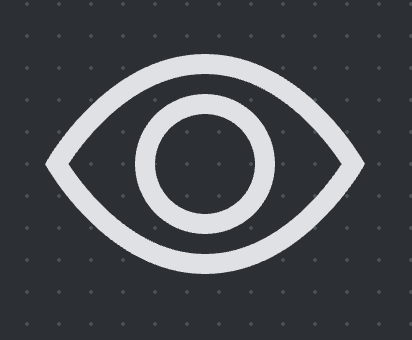

 # Icons — Design Reference

## 1. Purpose
Document the shared rules for the Sprint 01 icon set so every icon behaves consistently (size, color, alignment) and can be reused across UI-kit components without redefining SVG markup.

## 2. Scope
Applies to the following inline SVG icons that ship with the UI-kit:
`edit`, `watch`, `delete`, `settings`, `close`, `star`, `star-fill`.

## 3. Terminology
- Icon token: logical name for referencing the icon asset (e.g., `icon/star`).
- Parent color: CSS `color` value inherited from the surrounding component.

## 4. Design Dependencies
- Tokens:
	- [design/foundations/tokens.md#colours](../foundations/tokens.md#colours)

## 5. Conceptual Model
Icons are distributed as **inline SVG** symbols with a fixed viewBox (`0 0 16 16`). They inherit visual styling (fill/stroke) from the parent element’s computed `color`. This keeps icon color aligned with adjacent text or button states.


### 5.1 Icon Inventory

| Token             | Description       | Default usage |
|-------------------|-------------------|----------------|
| `icon/edit`       | Pencil outline    | Edit / rename affordances |
| `icon/watch`      | Eye outline       | Quick preview / watch states |
| `icon/delete`     | Trash can outline | Destructive actions |
| `icon/settings`   | Gear outline      | Access to configuration |
| `icon/close`      | "X" icon          | Dismiss / close interactions |
| `icon/star`       | Star outline      | Rating (unselected) |
| `icon/star-fill`  | Solid star        | Rating (selected / favorite) |

## 6. Behavioral Rules

### 6.1 Color inheritance
- All icons use `currentColor` for both `stroke` and `fill` attributes.
- No hard-coded hex values are allowed inside icon SVGs.

## 7. States & Variants
- **Sizes**: Height and width should be set via value `1rem`.
- **Color states**: icons inherit parent color, so variants come from host components; no per-icon state files are needed.
- **Theming**: Light/Dark modes work automatically through `currentColor`. Components should set the surrounding text color token to match theme requirements.

## 8. Layout & Responsiveness
- Icons should never stretch to fill container width/height; they remain square and scale proportionally per the size prop.

## 9. Tokens & Theming
- Icons do not introduce new tokens. They rely on existing tokens for:
  - Color: `--color-text`, `--color-link`, `--color-warning`, etc. (inherited via `currentColor`).
- Any new color usage must reference an existing token; do not embed literal hex values inside SVG data.

## 10. Accessibility
- Default icon usage is decorative: set `aria-hidden="true"` and `focusable="false"` when icons convey no standalone meaning.
- When an icon is the only content (e.g., icon button), provide an accessible name via `aria-label`, `aria-labelledby`, or visually hidden text on the host component; the icon itself should receive `role="img"` only if it supplies `aria-label`.
- Avoid using icons to communicate status without accompanying text or `aria-label`; pair with text or tooltips for clarity.

## 11. Rules & Constraints
1. Do not add drop shadows, gradients, or extra strokes unless approved in the design spec.

## 12. Non-normative Implementation Notes
- Use `<svg>` with `viewBox="0 0 16 16"` for all icons.

### 12.1 Example SVG markup
Settings icon example:


```svg
<svg xmlns="http://www.w3.org/2000/svg" width="16" height="16" fill="currentColor" class="bi bi-gear" viewBox="0 0 16 16">
  <path d="M8 4.754a3.246 3.246 0 1 0 0 6.492 3.246 3.246 0 0 0 0-6.492M5.754 8a2.246 2.246 0 1 1 4.492 0 2.246 2.246 0 0 1-4.492 0"/>
  <path d="M9.796 1.343c-.527-1.79-3.065-1.79-3.592 0l-.094.319a.873.873 0 0 1-1.255.52l-.292-.16c-1.64-.892-3.433.902-2.54 2.541l.159.292a.873.873 0 0 1-.52 1.255l-.319.094c-1.79.527-1.79 3.065 0 3.592l.319.094a.873.873 0 0 1 .52 1.255l-.16.292c-.892 1.64.901 3.434 2.541 2.54l.292-.159a.873.873 0 0 1 1.255.52l.094.319c.527 1.79 3.065 1.79 3.592 0l.094-.319a.873.873 0 0 1 1.255-.52l.292.16c1.64.893 3.434-.902 2.54-2.541l-.159-.292a.873.873 0 0 1 .52-1.255l.319-.094c1.79-.527 1.79-3.065 0-3.592l-.319-.094a.873.873 0 0 1-.52-1.255l.16-.292c.893-1.64-.902-3.433-2.541-2.54l-.292.159a.873.873 0 0 1-1.255-.52zm-2.633.283c.246-.835 1.428-.835 1.674 0l.094.319a1.873 1.873 0 0 0 2.693 1.115l.291-.16c.764-.415 1.6.42 1.184 1.185l-.159.292a1.873 1.873 0 0 0 1.116 2.692l.318.094c.835.246.835 1.428 0 1.674l-.319.094a1.873 1.873 0 0 0-1.115 2.693l.16.291c.415.764-.42 1.6-1.185 1.184l-.291-.159a1.873 1.873 0 0 0-2.693 1.116l-.094.318c-.246.835-1.428.835-1.674 0l-.094-.319a1.873 1.873 0 0 0-2.692-1.115l-.292.16c-.764.415-1.6-.42-1.184-1.185l.159-.291A1.873 1.873 0 0 0 1.945 8.93l-.319-.094c-.835-.246-.835-1.428 0-1.674l.319-.094A1.873 1.873 0 0 0 3.06 4.377l-.16-.292c-.415-.764.42-1.6 1.185-1.184l.292.159a1.873 1.873 0 0 0 2.692-1.115z"/>
</svg>
```
---
Watch icon example:


```svg
<svg xmlns="http://www.w3.org/2000/svg" width="16" height="16" fill="currentColor" class="bi bi-eye" viewBox="0 0 16 16">
  <path d="M16 8s-3-5.5-8-5.5S0 8 0 8s3 5.5 8 5.5S16 8 16 8M1.173 8a13 13 0 0 1 1.66-2.043C4.12 4.668 5.88 3.5 8 3.5s3.879 1.168 5.168 2.457A13 13 0 0 1 14.828 8q-.086.13-.195.288c-.335.48-.83 1.12-1.465 1.755C11.879 11.332 10.119 12.5 8 12.5s-3.879-1.168-5.168-2.457A13 13 0 0 1 1.172 8z"/>
  <path d="M8 5.5a2.5 2.5 0 1 0 0 5 2.5 2.5 0 0 0 0-5M4.5 8a3.5 3.5 0 1 1 7 0 3.5 3.5 0 0 1-7 0"/>
</svg>
```
---
Edit icon example:


```svg
<svg xmlns="http://www.w3.org/2000/svg" width="16" height="16" fill="currentColor" class="bi bi-pencil" viewBox="0 0 16 16">
  <path d="M12.146.146a.5.5 0 0 1 .708 0l3 3a.5.5 0 0 1 0 .708l-10 10a.5.5 0 0 1-.168.11l-5 2a.5.5 0 0 1-.65-.65l2-5a.5.5 0 0 1 .11-.168zM11.207 2.5 13.5 4.793 14.793 3.5 12.5 1.207zm1.586 3L10.5 3.207 4 9.707V10h.5a.5.5 0 0 1 .5.5v.5h.5a.5.5 0 0 1 .5.5v.5h.293zm-9.761 5.175-.106.106-1.528 3.821 3.821-1.528.106-.106A.5.5 0 0 1 5 12.5V12h-.5a.5.5 0 0 1-.5-.5V11h-.5a.5.5 0 0 1-.468-.325"/>
</svg>
```
---
Delete icon example:


```svg
<svg xmlns="http://www.w3.org/2000/svg" width="16" height="16" fill="currentColor" class="bi bi-trash3" viewBox="0 0 16 16">
  <path d="M6.5 1h3a.5.5 0 0 1 .5.5v1H6v-1a.5.5 0 0 1 .5-.5M11 2.5v-1A1.5 1.5 0 0 0 9.5 0h-3A1.5 1.5 0 0 0 5 1.5v1H1.5a.5.5 0 0 0 0 1h.538l.853 10.66A2 2 0 0 0 4.885 16h6.23a2 2 0 0 0 1.994-1.84l.853-10.66h.538a.5.5 0 0 0 0-1zm1.958 1-.846 10.58a1 1 0 0 1-.997.92h-6.23a1 1 0 0 1-.997-.92L3.042 3.5zm-7.487 1a.5.5 0 0 1 .528.47l.5 8.5a.5.5 0 0 1-.998.06L5 5.03a.5.5 0 0 1 .47-.53Zm5.058 0a.5.5 0 0 1 .47.53l-.5 8.5a.5.5 0 1 1-.998-.06l.5-8.5a.5.5 0 0 1 .528-.47M8 4.5a.5.5 0 0 1 .5.5v8.5a.5.5 0 0 1-1 0V5a.5.5 0 0 1 .5-.5"/>
</svg>
```
---
Close icon example:


```svg
<svg xmlns="http://www.w3.org/2000/svg" width="16" height="16" fill="currentColor" class="bi bi-x" viewBox="0 0 16 16">
  <path d="M4.646 4.646a.5.5 0 0 1 .708 0L8 7.293l2.646-2.647a.5.5 0 0 1 .708.708L8.707 8l2.647 2.646a.5.5 0 0 1-.708.708L8 8.707l-2.646 2.647a.5.5 0 0 1-.708-.708L7.293 8 4.646 5.354a.5.5 0 0 1 0-.708"/>
</svg>
```
---
Star icon example:


```svg
<svg xmlns="http://www.w3.org/2000/svg" width="16" height="16" fill="currentColor" class="bi bi-star" viewBox="0 0 16 16">
  <path d="M2.866 14.85c-.078.444.36.791.746.593l4.39-2.256 4.389 2.256c.386.198.824-.149.746-.592l-.83-4.73 3.522-3.356c.33-.314.16-.888-.282-.95l-4.898-.696L8.465.792a.513.513 0 0 0-.927 0L5.354 5.12l-4.898.696c-.441.062-.612.636-.283.95l3.523 3.356-.83 4.73zm4.905-2.767-3.686 1.894.694-3.957a.56.56 0 0 0-.163-.505L1.71 6.745l4.052-.576a.53.53 0 0 0 .393-.288L8 2.223l1.847 3.658a.53.53 0 0 0 .393.288l4.052.575-2.906 2.77a.56.56 0 0 0-.163.506l.694 3.957-3.686-1.894a.5.5 0 0 0-.461 0z"/>
</svg>
```
---
Star-fill icon example:


```svg
<svg xmlns="http://www.w3.org/2000/svg" width="16" height="16" fill="currentColor" class="bi bi-star-fill" viewBox="0 0 16 16">
  <path d="M3.612 15.443c-.386.198-.824-.149-.746-.592l.83-4.73L.173 6.765c-.329-.314-.158-.888.283-.95l4.898-.696L7.538.792c.197-.39.73-.39.927 0l2.184 4.327 4.898.696c.441.062.612.636.282.95l-3.522 3.356.83 4.73c.078.443-.36.79-.746.592L8 13.187l-4.389 2.256z"/>
</svg>
```


## 13. Edge Cases
- Animations (spin, pulse) must reuse the same icon shapes and only modify transform/opacity; no extra DOM wrappers.
- When icons pair with badges or counters, ensure the enclosing component handles layout; do not embed badge shapes inside icon SVGs.
- If an icon must indicate a two-tone state (e.g., partially filled star), create a separate asset rather than layering fills at runtime.
- High-DPI displays: rely on vector nature; do not rasterize icons. If exporting PNG fallbacks, document them separately.

## 14. Change Impact
- Updates to any icon path require notifying dependent tickets/components.
- Any change to inheritance rules or sizing requires re-validation of icon button, chips, and navigation components.

