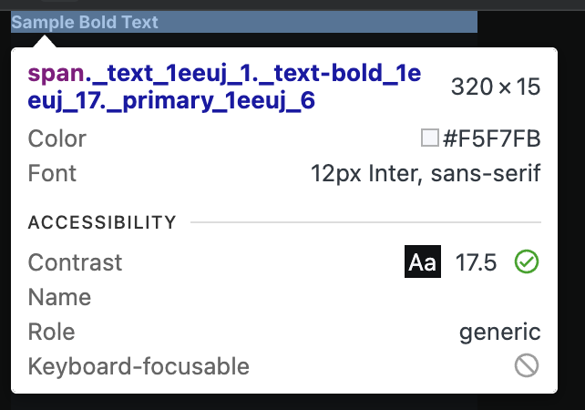

# TC-MC-0006 — UI: TextBold – Mobile – Dark Theme – Typography Tokens

## Objective

Validate that the `TextBold` UI component renders correctly on **Mobile** viewport in **Dark theme**, using the expected typography design tokens and computed styles defined in ticket  
[MC-0001-UI-kit-Create-Text-component](../tickets/MC-0001-UI-kit-Create-Text-component.md).

Specifically confirm on mobile range (<768px):

- correct font family
- correct mobile font size from token `--fonts-size-text`
- correct font-weight via `--font-weight-semi`
- correct text color (`--color-text`)
- correct line-height
- no visual or spacing inconsistencies

---

## Preconditions

- Application or Storybook is running.
- The `TextBold` component is available (e.g., via Storybook story `UI / Atoms / TextBold`).
- Browser viewport width is within **mobile range ≤767px**.
- Application theme is set to **Dark**.
- Design tokens are loaded:
	- `--color-text`
	- `--fonts-size-text`
	- `--font-weight-semi`
- Browser devtools are available to inspect computed styles.

---

## Test Data

_Static UI verification; no dynamic data required._

Environment assumptions:

| Parameter      | Value                    |
|----------------|--------------------------|
| Device         | Mobile (simulated)       |
| Viewport       | ≤767px                   |
| Theme          | Dark                     |
| Browser        | Latest Chrome / Chromium |

Recommended specific widths:

| Scenario       | Width (px) |
|----------------|------------|
| Mobile check   | 375        |

---

## Steps

1. Open Storybook or the application in a desktop browser.
2. Set viewport width to a mobile value within **≤767px** (for example, **375px**).
3. Ensure the **Dark** theme is active.
4. Navigate to the [page](https://leva13007.github.io/memora-cards-storybook/iframe.html?id=ui-atoms-textbold--default&viewMode=story&globals=theme:dark) or [Storybook story](https://leva13007.github.io/memora-cards-storybook/?path=/docs/ui-atoms-textbold--docs) that showcases the `TextBold` component (`UI / Atoms / TextBold`).
5. Identify a sample `TextBold` text element (e.g., “Sample Bold Text”).
6. Open browser devtools and inspect the element.
7. In the **Styles** or **Computed** panel, verify the following CSS properties:
	 - `font-family`
	 - `font-size`
	 - `font-weight`
	 - `line-height`
	 - `color`
8. Confirm that the styles originate from or match the expected design tokens:
	 - `--fonts-size-text`
	 - `--font-weight-semi`
	 - `--color-text`

---

## Expected Result

- `font-family` = inherit from (_Inter_) or **Inter**
- `font-size` = **0.75rem (12px)** for mobile, sourced from `--fonts-size-text`
- `font-weight` = **600**, mapped from token `--font-weight-semi`
- `line-height` = **normal** (or browser-resolved equivalent)
- `color` = `#f5f7fb` equals the resolved value of **`--color-text`** for **Dark theme**
- No unexpected spacing, clipping, overlaps, or rendering artifacts

---

## Screenshots / Attachments (optional)

- Screenshot of component rendering on Mobile + Dark theme at ~375px width

---

## Edge Cases  
*(Not required for pass/fail, but recommended to observe)*

- Move viewport just below and above the mobile range:
	- **<768px** should consistently use `0.75rem` font-size
	- **768–1192px** (tablet) should use `0.875rem` font-size
	- **≥1193px** (desktop) should use `1rem` font-size
- Toggle Dark → Light → Dark and verify color token re-evaluates correctly back to Dark theme value.
- Test long text wrapping and multi-line content to ensure no layout shifts at small mobile width.

---

## Notes

- This test case covers only **Mobile (≤767px) + Dark theme**.
- Complementary test cases cover Desktop/Tablet and Light theme variants.

---

## Related

- Ticket: [MC-0001](../tickets/MC-0001-UI-kit-Create-Text-component.md)
- Related test cases:
	- [TC-MC-0001 – TextBold – Desktop – Light Theme](./TC-MC-0001-UI-TextBold-Desktop-LightTheme.md)
	- [TC-MC-0002 – TextBold – Desktop – Dark Theme](./TC-MC-0002-UI-TextBold-Desktop-DarkTheme.md)
	- [TC-MC-0003 – TextBold – Tablet – Light Theme](./TC-MC-0003-UI-TextBold-Tablet-LightTheme.md)
	- [TC-MC-0004 – TextBold – Tablet – Dark Theme](./TC-MC-0004-UI-TextBold-Tablet-DarkTheme.md)
	- [TC-MC-0005 – TextBold – Mobile – Light Theme](./TC-MC-0005-UI-TextBold-Mobile-LightTheme.md)

