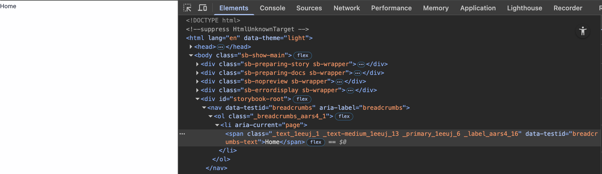
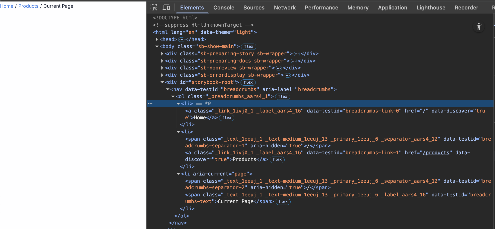

# TC-MC-0041 — UI: Breadcrumbs — Composition rules (links vs text)

## Objective
Verify Breadcrumbs **composition rules**:
- items with `link` render as `TextLink` **unless** the item is the last one
- items without `link` render as `TextMedium`
- the last item is **always** `TextMedium` and **never** a link (even if `link` provided)

This test deliberately **does not** re-check typography tokens for `TextLink` / `TextMedium` (they are covered by their own test cases).

---

## Preconditions
- Storybook is available.
- Breadcrumbs story exists under `UI / Molecules / Breadcrumbs`.
- Browser devtools are available to inspect the DOM (to distinguish link vs non-link).

---

## Test Data

Prepare three `items` inputs:

### Scenario 1 — single item (with link)
```json
[{ "label": "Home", "link": "/home" }]
```

### Scenario 2 — a few items (3), last without link
```json
[
	{ "label": "Home", "link": "/home" },
	{ "label": "Library", "link": "/library" },
	{ "label": "Current page" }
]
```

### Scenario 3 — a few items (3), last with link
```json
[
	{ "label": "Home", "link": "/home" },
	{ "label": "Library", "link": "/library" },
	{ "label": "Current page", "link": "/current" }
]
```

---

## Steps

### Scenario 1: single item (with link)
1. Open the [Breadcrumbs story](https://leva13007.github.io/memora-cards-storybook/?path=/story/ui-molecules-breadcrumbs--default) or navige to the [Component Storybook page](https://leva13007.github.io/memora-cards-storybook/iframe.html?id=ui-molecules-breadcrumbs--default&viewMode=story&args=items[1]:!undefined;items[2]:!undefined).
2. Set `items` to Scenario 1.
3. Inspect the rendered breadcrumb item.

### Scenario 2: 3 items, last without link
1. Open the [Breadcrumbs story](https://leva13007.github.io/memora-cards-storybook/?path=/story/ui-molecules-breadcrumbs--default) or navige to the [Component Storybook page](https://leva13007.github.io/memora-cards-storybook/iframe.html?id=ui-molecules-breadcrumbs--default&viewMode=story).
2. Set `items` to Scenario 2.
3. Inspect item 0 and item 1.
4. Inspect item 2.

### Scenario 3: 3 items, last with link
1. Open the [Breadcrumbs story](https://leva13007.github.io/memora-cards-storybook/?path=/story/ui-molecules-breadcrumbs--default) or navige to the [Component Storybook page](https://leva13007.github.io/memora-cards-storybook/iframe.html?id=ui-molecules-breadcrumbs--default&viewMode=story&args=items[2].link:current).
2. Set `items` to Scenario 3.
3. Inspect item 2.

---

## Expected Result

### Scenario 1: single item (with link)
- Item 0 is rendered as **TextMedium (non-link)** (for example see the link: [TC-MC-0007](../TextMedium/TC-MC-0007-UI-TextMedium-Desktop-LightTheme.md)) because it is the **last** item.
- Item 0 has `aria-current="page"`.

### Scenario 2: 3 items, last without link
- Item 0 and Item 1 are rendered as **TextLink** (for example see the link: [TC-MC-0019](../TextLink/TC-MC-0019-UI-TextLink-Desktop-LightTheme.md)) and displayed as **links** because:
	- they have `link`
	- they are not the last item
- Item 2 is rendered as **TextMedium (non-link)** (for example see the link: [TC-MC-0007](../TextMedium/TC-MC-0007-UI-TextMedium-Desktop-LightTheme.md)).
- Item 2 has `aria-current="page"`.

### Scenario 3: 3 items, last with link
- Item 0 and Item 1 are rendered as **TextLink** (for example see the link: [TC-MC-0019](../TextLink/TC-MC-0019-UI-TextLink-Desktop-LightTheme.md)) and displayed as **links** because:
	- they have `link`
	- they are not the last item
- Item 2 is rendered as **TextMedium (non-link)** (for example see the link: [TC-MC-0007](../TextMedium/TC-MC-0007-UI-TextMedium-Desktop-LightTheme.md)) even though `link` is provided, because it is the **last** item.
- Item 2 has `aria-current="page"`.

---

## Screenshots / Attachments (optional)

- Screenshot of Scenario 1: single item (with link)



- Screenshot of Scenario 2: 3 items, last without link



- Screenshot of Scenario 3: 3 items, last with link


---

## Edge Cases

- `items=[{label:'Only'}]` (no link): should render a single `TextMedium` item with `aria-current="page"` and no separators.
- Verify that only actual breadcrumb links are focusable with keyboard navigation (Tab): separators and current page should not be focusable.
- Verify if `items` is an empty array:
  - Decide expected implementation behavior (recommended): render nothing or render empty `<nav>` without errors.
- Verify if passed items have no links at all: all items should render as `TextMedium`, with the last item having `aria-current="page"`.
- Verify that if items have no label, they still render correctly (as links or text) without errors.

---

## Notes

- If Storybook Controls don’t allow editing `items` directly, validate these scenarios using any provided stories/examples or by switching to a local sandbox.

---

## Related

- Ticket: MC-0006-UI-kit-Create-Breadcrumbs-component
