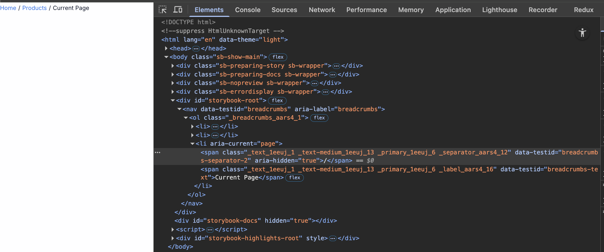
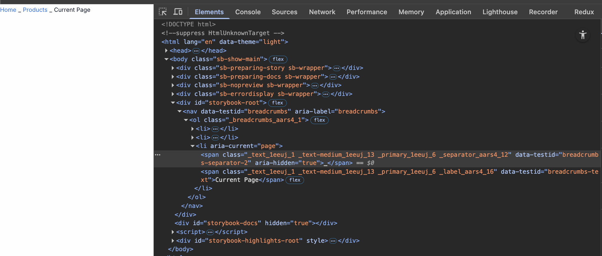

# TC-MC-0042 — UI: Breadcrumbs — Separators

## Objective
Verify Breadcrumbs separator behavior:
- default separator is `/`
- separators render **between** items only (never after last)
- separators are rendered using `TextMedium`
- separators are ignored by screen readers (`aria-hidden="true"`)

---

## Preconditions
- Storybook is available.
- Breadcrumbs component is available under `UI / Molecules / Breadcrumbs`.
- Browser devtools are available (DOM + accessibility tree inspection).

References:
- Ticket: [MC-0006-UI-kit-Create-Breadcrumbs-component.md](../../../tickets/Story/MC-0006-UI-kit-Create-Breadcrumbs-component.md)
- Storybook docs: https://leva13007.github.io/memora-cards-storybook/?path=/docs/ui-molecules-breadcrumbs--docs
- Storybook story: https://leva13007.github.io/memora-cards-storybook/iframe.html?id=ui-molecules-breadcrumbs--default&viewMode=story

---

## Test Data

Use at least 3 breadcrumb items to validate separator count/placement:

```json
[
	{ "label": "Home", "link": "/home" },
	{ "label": "Library", "link": "/library" },
	{ "label": "Current page" }
]
```

---

## Steps

### Scenario 1 — Default separator (`/`)
1. Open the Breadcrumbs story [Breadcrumbs story](https://leva13007.github.io/memora-cards-storybook/?path=/story/ui-molecules-breadcrumbs--default) or navige to the [Component Storybook page](https://leva13007.github.io/memora-cards-storybook/iframe.html?id=ui-molecules-breadcrumbs--default&viewMode=story).
2. Set `items` to the Test Data above.
3. Ensure `separator` is not provided (default).
4. Verify visible separators render between items.
5. Verify there is **no separator after the last item**.
6. Verify there is **no separator before the first item**.
7. Verify the separator content is `/`.

### Scenario 2 — Separator uses `TextMedium`
1. [Breadcrumbs story](https://leva13007.github.io/memora-cards-storybook/?path=/story/ui-molecules-breadcrumbs--default) or navige to the [Component Storybook page](https://leva13007.github.io/memora-cards-storybook/iframe.html?id=ui-molecules-breadcrumbs--default&viewMode=story).
2. Inspect the separator rendering in the DOM.
3. Verify the separator is wrapped/rendered with `TextMedium` (i.e., separator typography is produced by the TextMedium component rather than raw text).
	 - Note: validate via component wrapper markup, data attributes, or by checking that the separator inherits `TextMedium`-level styling structure used in your UI-kit.

### Scenario 3 — Custom separator value
1. [Breadcrumbs story](https://leva13007.github.io/memora-cards-storybook/?path=/story/ui-molecules-breadcrumbs--default) or navige to the [Component Storybook page](https://leva13007.github.io/memora-cards-storybook/iframe.html?id=ui-molecules-breadcrumbs--default&viewMode=story&args=separator:_).
2. Set `separator` to a custom string, for example `"_"`(underscore character). There is a [restriction](https://storybook.js.org/docs/writing-stories/args#setting-args-through-the-url) on which character to use here.
3. Verify the separator content changes accordingly.
4. Verify it still:
	 - renders using `TextMedium`

---

## Expected Result

### Scenario 1 — Default separator (`/`)
- Separators are visible between existing items
- No separator after the last item
- No separator befor the first item
- Separator content is `/`

### Scenario 2 — Separator uses `TextMedium`
- Separator is rendered using the `TextMedium` component (for example see the link: [TC-MC-0007](../TextMedium/TC-MC-0007-UI-TextMedium-Desktop-LightTheme.md))

### Scenario 3 — Custom separator value
- Separator content updates to the custom value (e.g., `"_"`).
- Separator continues to use `TextMedium`component (for example see the link: [TC-MC-0007](../TextMedium/TC-MC-0007-UI-TextMedium-Desktop-LightTheme.md))

---

## Screenshots / Attachments (optional)

- Screenshot of Scenario 1 — Default separator (`/`)



- Screenshot of Scenario 3 — Custom separator value (`_`)



---

## Edge Cases

- `items` length is 0 or 1:
	- no separators must be rendered.
- Separator is a whitespace string (e.g. `' '`):
	- verify layout doesn’t break and separator still remains `aria-hidden`.

---

## Notes

- This test focuses on separator composition/accessibility; it does not re-test typography token values of `TextMedium`.

---

## Related

- Ticket: MC-0006-UI-kit-Create-Breadcrumbs-component
