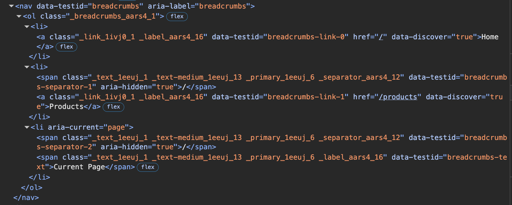

# TC-MC-0043 — UI: Breadcrumbs — Accessibility & semantics

## Objective
Validate that `Breadcrumbs` meets the required **semantic HTML** and **accessibility** rules defined in `MC-0006`:
- `nav` landmark with `aria-label="breadcrumbs"`
- ordered list structure (`ol` + `li`)
- last item has `aria-current="page"`
- separators are ignored by AT (`aria-hidden="true"`) and are not focusable
- keyboard focus moves only through actual links (not separators, not current page)

---

## Preconditions
- Storybook is available.
- Breadcrumbs component exists under `UI / Molecules / Breadcrumbs`.
- Browser devtools are available:
	- Elements panel (DOM)
	- Accessibility tree / Accessibility panel

References:
- Ticket: `tickets/MC-0006-UI-kit-Create-Breadcrumbs-component.md`
- Storybook docs: https://leva13007.github.io/memora-cards-storybook/?path=/docs/ui-molecules-breadcrumbs--docs
- Storybook story: https://leva13007.github.io/memora-cards-storybook/iframe.html?id=ui-molecules-breadcrumbs--default&viewMode=story

---

## Test Data

Use at least 3 items where at least one is a link and the last item is current page:

```json
[
	{ "label": "Home", "link": "/home" },
	{ "label": "Library", "link": "/library" },
	{ "label": "Current page" }
]
```

Optional: set `dataTestId="breadcrumbs"` if control exists (helps targeting nodes quickly).

---

## Steps

### Scenario 1 — Semantic structure
1. Open the Breadcrumbs story.
2. Set `items` to the Test Data above.
3. Inspect the DOM structure.
4. Verify the root element is a `nav`.
5. Verify the `nav` has `aria-label="breadcrumbs"`.
6. Verify that inside `nav` there is an `ol`.
7. Verify each breadcrumb item is rendered as an `li` inside the `ol`.

### Scenario 2 — Current page semantics
1. Identify the last breadcrumb item.
2. Verify it has `aria-current="page"`.
3. Verify the last breadcrumb item is not a link (no `a[href]` for current page).

### Scenario 3 — Separator accessibility
1. Identify separator elements between items.
2. Verify each separator has `aria-hidden="true"`.
3. Verify separators are not links and are not interactive.

### Scenario 4 — Keyboard navigation (Tab order)
1. Click outside the component to reset focus.
2. Press `Tab` repeatedly.
3. Observe focus order.

---

## Expected Result
- `Breadcrumbs` renders inside `nav[aria-label="breadcrumbs"]`.
- A single `ol` exists under the `nav`, and breadcrumbs are rendered as `li` elements.
- The last breadcrumb item:
	- has `aria-current="page"`
	- is not rendered as a link
- Separators:
	- have `aria-hidden="true"`
	- do not appear as focusable elements
- Keyboard navigation:
	- focus lands only on interactive breadcrumb links (non-last items with links)
	- focus does not land on separators
	- focus does not land on the current page item

---

## Screenshots / Attachments (optional)



---

## Edge Cases

- Single item breadcrumb:
	- still uses `nav` + `ol` + `li`
	- item has `aria-current="page"`
	- no separators
- Last item has `link` in data:
	- must still be rendered as non-link current page with `aria-current="page"`

---

## Notes

- This TC validates structural/a11y requirements only and does not validate typography tokens.

---

## Related

- Ticket: MC-0006-UI-kit-Create-Breadcrumbs-component
