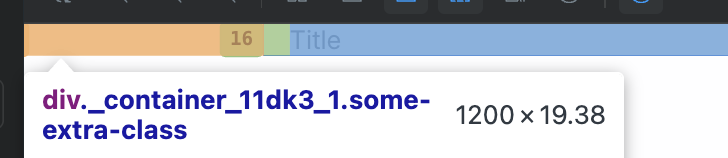

# TC-MC-0037 — UI: Container – Desktop – Non-fluid layout

## Objective  
Validate that the `Container` UI component renders correctly on **Desktop** viewport in **non-fluid** mode (`fluid` omitted or `false`), using the expected layout behavior defined in ticket  
[MC-0005-UI-kit-Create-Container-component](../../../tickets/Story/MC-0005-UI-kit-Create-Container-component.md).

Specifically confirm on desktop viewport (≥1280px):

- Root element is a semantic `
`
- Container is horizontally centered via `margin-left: auto; margin-right: auto;`
- Horizontal padding comes from `--container-padding` (default `1rem`) and is **not** hard-coded
- Container width is fixed to **1200px** on Desktop when `fluid` is `false` / omitted
- No unexpected clipping, overflow, or layout shifts

---

## Preconditions  

- Application or Storybook is running.
- The `Container` component is available (e.g., via Storybook story `UI / Atoms / Container`).
- Browser viewport width is ≥ **1280px** (Desktop breakpoint).
- Application theme is set to a valid theme (Light or Dark); layout behavior is independent of theme.
- Design tokens are loaded:
  - `--container-padding`
- Browser devtools are available to inspect computed styles.

---

## Test Data  

Environment assumptions:

| Parameter      | Value                    |
|----------------|--------------------------|
| Device         | Desktop                  |
| Viewport       | ≥ 1280px                 |
| Theme          | Light or Dark            |
| Browser        | Latest Chrome / Chromium |

Recommended specific width:

| Scenario       | Width (px) |
|----------------|------------|
| Desktop check  | 1440       |

Component configuration:

- `fluid`: **false** or omitted (default behavior)

---

## Steps  

1. Open Storybook or the application in a desktop browser.
2. Set browser viewport width to a desktop value **≥1280px** (for example, **1440px**).
3. Set the application theme to either **Light** or **Dark** (layout behavior is theme-independent).
4. Navigate to the `Container` default story:
   - Docs: [link](https://leva13007.github.io/memora-cards-storybook/?path=/docs/ui-atoms-container--docs)
   - Story: [link](https://leva13007.github.io/memora-cards-storybook/iframe.html?id=ui-atoms-container--default&viewMode=story)
5. In Storybook controls (if available), ensure that:
   - `fluid` is **false** or not set.
6. Locate the rendered `Container` in the canvas. It may wrap example content (e.g., text blocks or headings).
7. Open browser devtools and inspect the root element of the `Container`.
8. In the **Elements** panel, verify:
   - The root element is a semantic `
`.
9. In the **Styles** or **Computed** panel for the root `
`, verify:
   - `margin-left: auto;`
   - `margin-right: auto;`
   - `padding-left` is resolved from `var(--container-padding, 0)` (default should equal `1rem`).
   - `padding-right` is resolved from `var(--container-padding, 0)`.
   - `width: 1200px` at desktop viewport width.
10. Confirm that no hard-coded padding value (such as `1rem`) is set directly; instead, it must come from the `--container-padding` token.
11. Resize the viewport slightly within the desktop range (for example, from 1280px up to 1600px) and verify:
    - The `Container` width remains **1200px**.
    - The `Container` stays centered via auto horizontal margins.
12. Visually inspect the layout to ensure there is no horizontal scroll introduced by the `Container`, and content inside it remains readable and well-aligned.

---

## Expected Result  

- The `Container` root element is a semantic `
`.
- At viewport widths ≥1280px with `fluid` set to `false` / omitted:
  - The container is horizontally centered using `margin-left: auto; margin-right: auto;`.
  - Horizontal padding left and right is applied via `--container-padding` that equal `1rem`, **not** hard-coded.
  - The container has `width: 1200px`.
- When resizing the viewport within the desktop range (≥1280px):
  - The container width remains fixed at **1200px**.
  - The container stays centered in the viewport.
- No layout artifacts such as:
  - Unexpected horizontal scrollbars caused by the container.
  - Clipping of child content inside the container at standard desktop widths.

---

## Screenshots / Attachments  

- Screenshot of `Container` rendering on Desktop at ≥1280px width (e.g., 1440px) showing fixed-width centered layout with inner content.

---

## Edge Cases  

- Resize viewport width near the desktop breakpoint (for example **1279px** ↔ **1281px**) and confirm:
  - At **<1280px**, behavior should switch to Tablet rules (covered in a separate Tablet test case).
  - At **≥1280px**, the container uses **1200px** width (Desktop behavior).
- Override `--container-padding` in a parent or theme (for example, to `2rem`) and verify that:
  - The effective `padding-left` / `padding-right` change accordingly.
  - The container width (1200px) and centering are not affected.
- Inspect behavior with long or tall content inside the `Container` to ensure no vertical or horizontal clipping occurs.

---

## Notes  

- This test case covers only **Desktop (≥1280px) + non-fluid layout** for the `Container` component.
- Separate test cases should cover:
  - Tablet and Mobile behavior for non-fluid mode.
  - `fluid={true}` behavior across all breakpoints.

---

## Related  

- Ticket: [MC-0005-UI-kit-Create-Container-component](../../../tickets/Story/MC-0005-UI-kit-Create-Container-component.md)