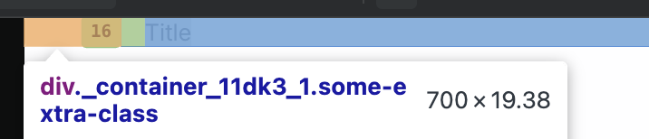

# TC-MC-0038 — UI: Container – Tablet – Non-fluid layout

## 🎯 Objective  
Validate that the `Container` UI component renders correctly on **Tablet** viewport in **non-fluid** mode (`fluid` omitted or `false`), using the expected layout behavior defined in ticket  
[MC-0005-UI-kit-Create-Container-component](../../../tickets/MC-0005-UI-kit-Create-Container-component.md).

Specifically confirm on tablet viewport (768–1279px):

- Root element is a semantic `
`
- Container is horizontally centered via `margin-left: auto; margin-right: auto;`
- Horizontal padding comes from `--container-padding` (default `1rem`) and is **not** hard-coded
- Container width is fixed to **700px** on Tablet when `fluid` is `false` / omitted
- No unexpected clipping, overflow, or layout shifts at tablet widths

---

## Preconditions  

- Application or Storybook is running.
- The `Container` component is available (e.g., via Storybook story `UI / Atoms / Container`).
- Browser viewport width is within **tablet range 768–1279px**.
- Application theme is set to a valid theme (Light or Dark); layout behavior is independent of theme.
- Design tokens are loaded:
  - `--container-padding`
- Browser devtools are available to inspect computed styles.

---

## Test Data  

Environment assumptions:

| Parameter      | Value                    |
|----------------|--------------------------|
| Device         | Tablet (simulated)       |
| Viewport       | 768–1279px               |
| Theme          | Light or Dark            |
| Browser        | Latest Chrome / Chromium |

Recommended specific width:

| Scenario       | Width (px) |
|----------------|------------|
| Tablet check   | 1024       |

Component configuration:

- `fluid`: **false** or omitted (default behavior)

---

## Steps  

1. Open Storybook or the application in a desktop browser.
2. Set browser viewport width to a tablet value within **768–1279px** (for example, **1024px**).
3. Navigate to the `Container` default story:
   - Docs: [link](https://leva13007.github.io/memora-cards-storybook/?path=/docs/ui-atoms-container--docs)
   - Story: [link](https://leva13007.github.io/memora-cards-storybook/iframe.html?id=ui-atoms-container--default&viewMode=story)
4. In Storybook controls (if available), ensure that:
   - `fluid` is **false** or not set.
5. Locate the rendered `Container` in the canvas. It may wrap example content (e.g., text blocks or headings).
6. Open browser devtools and inspect the root element of the `Container`.
7. In the **Elements** panel, verify:
   - The root element is a semantic `
`.
8. In the **Styles** or **Computed** panel for the root `
`, verify:
   - `margin-left: auto;`
   - `margin-right: auto;`
   - `padding-left` is resolved from `var(--container-padding, 0)` (default should equal `1rem`).
   - `padding-right` is resolved from `var(--container-padding, 0)`.
   - `width: 700px` at tablet viewport width.
9. Confirm that no hard-coded padding value (such as `1rem`) is set directly; instead, it must come from the `--container-padding` token.
10. Resize the viewport slightly within the tablet range (for example, from 800px up to 1200px but <1280px) and verify:
    - The `Container` width remains **700px**.
    - The `Container` stays centered via auto horizontal margins.
11. Visually inspect the layout to ensure there is no horizontal scroll introduced by the `Container`, and content inside it remains readable and well-aligned.

---

## Expected Result  

- The `Container` root element is a semantic `
`.
- At viewport widths within 768–1279px with `fluid` set to `false` / omitted:
  - The container is horizontally centered using `margin-left: auto; margin-right: auto;`.
  - The container has `width: 700px`.
  - Horizontal padding left and right is applied via `--container-padding` (default `1rem`), **not** hard-coded.
- When resizing the viewport within the tablet range (768–1279px):
  - The container width remains fixed at **700px**.
  - The container stays centered in the viewport.
- No layout artifacts such as:
  - Unexpected horizontal scrollbars caused by the container.
  - Clipping of child content inside the container at standard tablet widths.

---

## Screenshots / Attachments  

- Screenshot of `Container` rendering on Tablet around 1024px width showing fixed-width centered layout with inner content.

---

## Edge Cases  

- Resize viewport width near the **Mobile ↔ Tablet** breakpoint (for example **767px** ↔ **769px**) and confirm:
  - At **≤767px**, behavior switches to Mobile rules (width 100%, max-width 100%), covered in a separate Mobile test case.
  - At **≥768px**, tablet behavior with **700px** fixed width applies.
- Resize viewport width near the **Tablet ↔ Desktop** breakpoint (for example **1279px** ↔ **1281px**) and confirm:
  - At **≤1279px**, tablet behavior with **700px** width applies.
  - At **≥1280px**, Desktop behavior (width **1200px**) applies, covered in TC-MC-0037.
- Override `--container-padding` in a parent or theme (for example, to `2rem`) and verify that:
  - The effective `padding-left` / `padding-right` change accordingly.
  - The container width (700px) and centering are not affected.
- Inspect behavior with long or tall content inside the `Container` to ensure no vertical or horizontal clipping occurs at tablet widths.

---

## Notes  

- This test case covers only **Tablet (768–1279px) + non-fluid layout** for the `Container` component.
- Separate test cases should cover:
  - Desktop and Mobile behavior for non-fluid mode.
  - `fluid={true}` behavior across all breakpoints.

---

## Related  

- Ticket: [MC-0005](../../../tickets/MC-0005-UI-kit-Create-Container-component.md)
- Other test cases (planned or existing):
  - [TC-MC-0037 — Container – Desktop – Non-fluid layout](./TC-MC-0037-UI-Container-Desktop.md)
  - TC-MC-0039 — Container – Mobile – Non-fluid layout
  - TC-MC-0040 — Container – Desktop/Tablet/Mobile – Fluid layout
