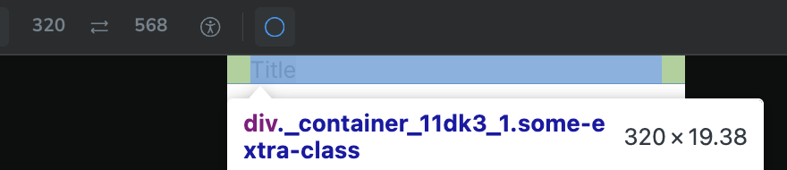

# TC-MC-0039 — UI: Container – Mobile – Non-fluid layout

## 🎯 Objective  
Validate that the `Container` UI component renders correctly on **Mobile** viewport in **non-fluid** mode (`fluid` omitted or `false`), using the expected layout behavior defined in ticket  
[MC-0005-UI-kit-Create-Container-component](../../../tickets/MC-0005-UI-kit-Create-Container-component.md).

Specifically confirm on mobile viewport (<768px):

- Root element is a semantic `
`
- Container is horizontally centered via `margin-left: auto; margin-right: auto;`
- Horizontal padding comes from `--container-padding` (default `1rem`) and is **not** hard-coded
- Container uses **full-width behavior**:
  - `width: 100%`
  - `max-width: 100%`
- No unexpected clipping, overflow, or layout shifts at narrow mobile widths

---

## Preconditions  

- Application or Storybook is running.
- The `Container` component is available (e.g., via Storybook story `UI / Atoms / Container`).
- Browser viewport width is within **mobile range <768px**.
- Application theme is set to a valid theme (Light or Dark); layout behavior is independent of theme.
- Design tokens are loaded:
  - `--container-padding`
- Browser devtools are available to inspect computed styles.

---

## Test Data  

Environment assumptions:

| Parameter      | Value                    |
|----------------|--------------------------|
| Device         | Mobile (simulated)       |
| Viewport       | < 768px                  |
| Theme          | Light or Dark            |
| Browser        | Latest Chrome / Chromium |

Recommended specific widths:

| Scenario         | Width (px) |
|------------------|------------|
| Small mobile     | 320        |
| Typical mobile   | 375–414    |

Component configuration:

- `fluid`: **false** or omitted (default behavior)

---

## Steps  

1. Open Storybook or the application in a desktop browser with responsive mode, or directly on a mobile device.
2. Set browser viewport width to a mobile value **<768px** (for example, **375px** or **414px**).
3. Navigate to the `Container` default story:
   - Docs: [link](https://leva13007.github.io/memora-cards-storybook/?path=/docs/ui-atoms-container--docs)
   - Story: [link](https://leva13007.github.io/memora-cards-storybook/iframe.html?id=ui-atoms-container--default&viewMode=story)
4. In Storybook controls (if available), ensure that:
   - `fluid` is **false** or not set.
5. Locate the rendered `Container` in the canvas. It may wrap example content (e.g., text blocks or headings).
6. Open browser devtools and inspect the root element of the `Container`.
7. In the **Elements** panel, verify:
   - The root element is a semantic `
`.
8. In the **Styles** or **Computed** panel for the root `
`, verify:
   - `margin-left: auto;`
   - `margin-right: auto;`
   - `padding-left` is resolved from `var(--container-padding, 0)`.
   - `padding-right` is resolved from `var(--container-padding, 0)`.
   - `width: 100%`.
   - `max-width: 100%`.
9. Confirm that no hard-coded padding value (such as `1rem`) is set directly; instead, it must come from the `--container-padding` token.
10. Test multiple mobile widths within the mobile range (for example, 320px, 375px, 414px, 767px) and verify:
    - The `Container` always expands to fill the available width (100%).
    - The `Container` stays centered via auto horizontal margins.
11. Visually inspect the layout to ensure there is no unintended horizontal scroll introduced by the `Container` (beyond what content itself might require), and content inside it remains readable and well-aligned.

---

## Expected Result  

- The `Container` root element is a semantic `
`.
- At viewport widths <768px with `fluid` set to `false` / omitted:
  - The container is horizontally centered using `margin-left: auto; margin-right: auto;`.
  - The container has `width: 100%`.
  - The container has `max-width: 100%`.
  - Horizontal padding left and right is applied via `--container-padding` that equals to `1rem`, **not** hard-coded.
- When resizing the viewport within the mobile range (e.g., 320px–767px):
  - The container width continues to match the viewport width (full-width behavior).
  - The container stays visually centered and does not create extra horizontal scrollbars on its own.
- No layout artifacts such as:
  - Unexpected horizontal scrollbars caused by the container.
  - Clipping of child content inside the container at narrow widths.

---

## Screenshots / Attachments  

- Screenshot of `Container` rendering on a typical mobile width (e.g., 375px) showing full-width layout with inner content and visible side padding.

---

## Edge Cases  

- Resize viewport width near the **Mobile ↔ Tablet** breakpoint (for example **767px** ↔ **769px**) and confirm:
  - At **≤767px**, mobile behavior with `width: 100%; max-width: 100%` applies.
  - At **≥768px**, tablet behavior (fixed `700px` width) applies, covered in TC-MC-0038.
- Test very narrow widths (e.g., **<320px**, if your tooling allows) and confirm:
  - Content remains readable.
  - No unexpected horizontal scroll is introduced by the `Container` itself (beyond content overflow).
- Override `--container-padding` in a parent or theme (for example, to `0` or `2rem`) and verify that:
  - The effective `padding-left` / `padding-right` change accordingly.
  - Full-width behavior (`width: 100%; max-width: 100%`) and centering are not affected.

---

## Notes  

- This test case covers only **Mobile (<768px) + non-fluid layout** for the `Container` component.
- Separate test cases should cover:
  - Desktop and Tablet behavior for non-fluid mode.
  - `fluid={true}` behavior across all breakpoints.

---

## Related  

- Ticket: [MC-0005](../../../tickets/MC-0005-UI-kit-Create-Container-component.md)
