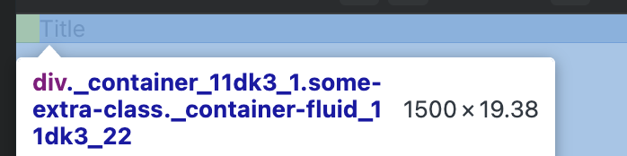
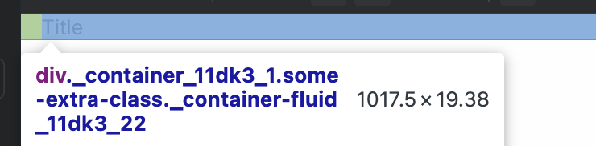

# TC-MC-0040 — UI: Container – Fluid layout – Desktop/Tablet/Mobile

## 🎯 Objective  
Validate that the `Container` UI component renders correctly in **fluid mode** (`fluid={true}`) across **Desktop**, **Tablet**, and **Mobile** viewports, using the expected layout behavior defined in ticket  
[MC-0005-UI-kit-Create-Container-component](../../../tickets/MC-0005-UI-kit-Create-Container-component.md).

Specifically confirm that when `fluid` is `true`:

- Root element is a semantic `
`
- Container is horizontally centered via `margin-left: auto; margin-right: auto;`
- Horizontal padding comes from `--container-padding` (default `1rem`) and is **not** hard-coded
- Container uses **full-width behavior** at **all breakpoints**:
  - `width: 100%`
  - `max-width: 100%` (where applicable)
- Fixed-width constraints for non-fluid mode (`1200px` on Desktop, `700px` on Tablet) do **not** apply in fluid mode

---

## Preconditions  

- Application or Storybook is running.
- The `Container` component is available (e.g., via Storybook story `UI / Atoms / Container`).
- Application theme is set to a valid theme (Light or Dark); layout behavior is independent of theme.
- Design tokens are loaded:
  - `--container-padding`
- Browser devtools are available to inspect computed styles.

---

## Test Data  

Environment assumptions:

| Parameter      | Value                    |
|----------------|--------------------------|
| Device         | Desktop/Tablet/Mobile    |
| Theme          | Light or Dark            |
| Browser        | Latest Chrome / Chromium |

Viewport ranges:

| Breakpoint | Range (px)        |
|------------|-------------------|
| Desktop    | ≥ 1280            |
| Tablet     | 768–1279          |
| Mobile     | ≤ 767             |

Component configuration:

- `fluid`: **true**

---

## Steps  

### A. General setup

1. Open Storybook or the application in a desktop browser.
2. Navigate to the `Container` default story:
   - Docs: [link](https://leva13007.github.io/memora-cards-storybook/?path=/docs/ui-atoms-container--docs)
   - Story: [link](https://leva13007.github.io/memora-cards-storybook/iframe.html?id=ui-atoms-container--default&viewMode=story&args=fluid:!true)
3. In Storybook controls (if available), set:
   - `fluid` = **true**.
4. Locate the rendered `Container` in the canvas. It may wrap example content (e.g., text blocks or headings).
5. Open browser devtools and inspect the root element of the `Container`.
6. In the **Elements** panel, verify once (applies to all breakpoints):
   - The root element is a semantic `
`.

### B. Desktop – fluid behavior

7. Set browser viewport width to a Desktop value **≥1280px** (for example, **1440px** or **1600px**).
8. In the **Styles** or **Computed** panel for the root `
`, verify:
   - `margin-left: auto;`
   - `margin-right: auto;`
   - `padding-left` is resolved from `var(--container-padding, 0)` (default should equal `1rem`).
   - `padding-right` is resolved from `var(--container-padding, 0)`.
   - `width: 100%` (not `1200px`).
9. Gradually increase the viewport width within the Desktop range (for example, from **1280px** up to **1920px**) and confirm:
   - The container continues to use `width: 100%`.
   - There is **no** fixed `1200px` width constraint applied when `fluid` is `true`.

### C. Tablet – fluid behavior

10. Set browser viewport width to a Tablet value within **768–1279px** (for example, **1024px**).
11. Re-verify on the root `
`:
   - `margin-left: auto; margin-right: auto;`
   - `padding-left` / `padding-right` derived from `var(--container-padding, 0)`.
   - `width: 100%` (not `700px`).
12. Resize the viewport within the Tablet range (for example, from **800px** to **1200px**, staying <1280px) and confirm:
   - The container width remains `100%` of the viewport.
   - There is **no** fixed `700px` constraint while `fluid` is `true`.

### D. Mobile – fluid behavior

13. Set browser viewport width to a Mobile value **≤767px** (for example, **375px** or **414px**).
14. Re-verify on the root `
`:
   - `margin-left: auto; margin-right: auto;`
   - `padding-left` / `padding-right` from `var(--container-padding, 0)`.
   - `width: 100%`.
   - `max-width: 100%`.
15. Test a few different mobile widths (e.g., **320px**, **375px**, **414px**, **767px**) and confirm:
   - The container always expands to fill the available viewport width.
   - No unexpected extra horizontal scrollbars are introduced by the container itself.

### E. Cross-breakpoint consistency

16. While keeping `fluid=true`, move gradually through all breakpoints:
   - Start at **mobile** (e.g., 375px).
   - Increase to **tablet** (e.g., 1024px).
   - Increase to **desktop** (e.g., 1440px+).
17. At several representative widths (e.g., 375px, 768px, 1024px, 1279px, 1280px, 1600px), verify:
   - The container always uses `width: 100%`.
   - Token-based padding is preserved.
   - There is no point where a fixed width (700px/1200px) unexpectedly reappears while `fluid` remains `true`.

---

## Expected Result  

For all breakpoints with `fluid={true}`:

- The `Container` root element is a `
`.
- The container remains horizontally centered via `margin-left: auto; margin-right: auto;`.
- Horizontal padding is provided via `--container-padding` and **not** via hard-coded values.
- **Desktop (≥1280px):**
  - `width: 100%` (no `1200px` fixed width).
- **Tablet (768–1279px):**
  - `width: 100%` (no `700px` fixed width).
- **Mobile (≤767px):**
  - `width: 100%`.
  - `max-width: 100%`.
- Changing viewport width across Desktop/Tablet/Mobile breakpoints while `fluid` is `true`:
  - Does **not** introduce breakpoint-specific fixed widths.
  - Keeps the container filling the available horizontal space.
- No layout artifacts such as:
  - Unexpected horizontal scrollbars created by the container.
  - Clipping of child content.

---

## Screenshots / Attachments  

- Screenshot of `Container` in fluid mode on Desktop (e.g., 1440px) showing full-width layout with inner content.

- Screenshot of fluid `Container` on Tablet (e.g., 1024px).

- Optional Screenshot of fluid `Container` on Mobile (e.g., 375px).

---

## Edge Cases  

- Toggle `fluid` **on and off** at a given breakpoint (e.g., Desktop at 1440px) and confirm:
  - `fluid=false` → fixed width (`1200px` on Desktop, `700px` on Tablet).
  - `fluid=true` → `width: 100%`.
- Override `--container-padding` in a parent or theme (e.g., `0`, `2rem`) and verify:
  - The effective padding changes as expected.
  - Width behavior (`100%`) and centering are not affected.
- Test extremely wide desktop resolutions (e.g., 1920px or above) to ensure:
  - Container continues to span full width without unexpected max-width constraints.
- Test very small mobile widths (e.g., <320px, if tooling allows) and ensure:
  - Full-width behavior is preserved.
  - Content remains usable without container-induced overflow.

---

## Notes  

- This test case focuses exclusively on **fluid mode** (`fluid={true}`) for the `Container` component.
- Non-fluid behavior for each breakpoint is covered separately in:
  - `TC-MC-0037` (Desktop – non-fluid)
  - `TC-MC-0038` (Tablet – non-fluid)
  - `TC-MC-0039` (Mobile – non-fluid)

---

## Related  

- Ticket: [MC-0005](../../../tickets/MC-0005-UI-kit-Create-Container-component.md)
