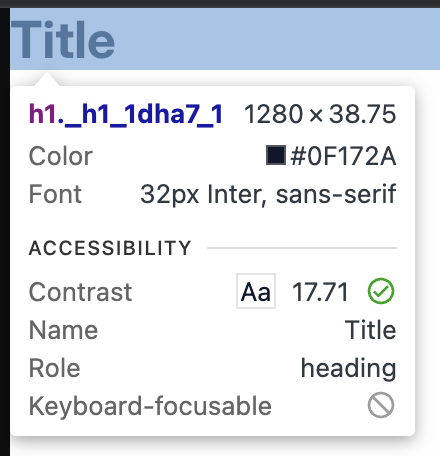

# TC-MC-0025 — UI: H1 – Desktop – Light Theme – Typography Tokens

## Objective

Validate that the `H1` UI component renders correctly on **Desktop** viewport in **Light theme**, using the expected typography design tokens and semantic `<h1>` behavior defined in ticket  
[MC-0003-UI-kit-Create-H1-component](../../../tickets/MC-0003-UI-kit-Create-H1-component.md).

Specifically confirm on desktop viewport (≥1280px):

- correct `<h1>` semantics in the DOM
- correct font family (inheriting **Inter**)
- correct desktop font size from token `--font-size-h-1`
- correct font-weight via `--font-weight-bold`
- correct text color for **Light** theme via `--color-text`
- correct line-height
- no visual or spacing inconsistencies

---

## Preconditions

- Application or Storybook is running.
- The `H1` component is available (e.g., via Storybook story `UI / Atoms / H1`).
- Browser viewport width is ≥ **1280px** (desktop breakpoint).
- Application theme is set to **Light**.
- Design tokens are loaded:
	- `--color-text`
	- `--font-size-h-1`
	- `--font-weight-bold`
- Browser devtools are available to inspect computed styles.

---

## Test Data

_Static UI verification; no dynamic data required._

Environment assumptions:

| Parameter      | Value                    |
|----------------|--------------------------|
| Device         | Desktop                  |
| Viewport       | ≥ 1280px                 |
| Theme          | Light                    |
| Browser        | Latest Chrome / Chromium |

---

## Steps

1. Open Storybook or the application in a desktop browser.
2. Set viewport width to **≥ 1280px**.
3. Ensure the **Light** theme is active.
4. Navigate to the [H1 default story iframe](https://leva13007.github.io/memora-cards-storybook/iframe.html?id=ui-atoms-h1--default&viewMode=story) or `H1` [Storybook docs page](https://leva13007.github.io/memora-cards-storybook/?path=/docs/ui-atoms-h1--docs) that showcases the `H1` component (`UI / Atoms / H1`).
5. If the story supports controls/args for content, set the heading text to a simple value (for example, `"Dashboard"`). Otherwise, use the default example text shown in the story.
6. Identify a rendered `H1` element in the canvas area.
7. Open browser devtools and inspect the heading element.
8. In the **Elements** panel, verify that the rendered element is a semantic `<h1>` (not ``, `
`, or another tag).
9. In the **Styles** or **Computed** panel, verify the following CSS properties on the `<h1>` element:
	- `font-family`
	- `font-size`
	- `font-weight`
	- `line-height`
	- `color`
10. Confirm that the typography styles originate from or match the expected design tokens:
	- `--font-size-h-1`
	- `--font-weight-bold`
	- `--color-text`
11. Visually inspect the heading at desktop width for any spacing, clipping, or layout issues.

---

## Expected Result

- The component renders a semantic heading element:
	- `<h1>…</h1>`
- `font-family` = inherit from (_Inter_) or **Inter**
- `font-size` = **2rem** for desktop, sourced from token `--font-size-h-1`
- `font-weight` = **700**, mapped from token `--font-weight-bold`
- `line-height` = **normal** (or browser-resolved equivalent)
- In **Light theme**:
	- `color` = `#0f172a` equals the resolved value of **`--color-text`**
- No unexpected spacing, clipping, overlaps, or rendering artifacts at desktop viewport widths

---

## Screenshots / Attachments (optional)

- Screenshot of `H1` rendering on Desktop + Light theme at ≥1280px width (showing default or example heading text)

---

## Edge Cases  
*(Not required for pass/fail, but recommended to observe)*
- Test long heading text that wraps to multiple lines and verify line-height and spacing remain visually consistent.
- Verify that global theme toggling Light → Dark → Light correctly updates `--color-text` for H1 (even though this test focuses on Light theme, brief Dark check can reveal token wiring issues).

---

## Notes

- This test case covers only **Desktop (≥1280px) + Light theme** for the `H1` component.
- Separate test cases should cover Dark theme and Tablet/Mobile breakpoints.
- Typography expectations must match the `H1` specification in MC-0003.

---

## Related

- Ticket: [MC-0003](../../../tickets/MC-0003-UI-kit-Create-H1-component.md)
- Related test cases (planned or existing):
	- (future) H1 – Desktop – Dark Theme
	- (future) H1 – Tablet – Light/Dark Theme
	- (future) H1 – Mobile – Light/Dark Theme
	- [TC-MC-0007 – TextMedium – Desktop – Light Theme](../TextMedium/TC-MC-0007-UI-TextMedium-Desktop-LightTheme.md)
	- [TC-MC-0019 – TextLink – Desktop – Light Theme](../TextLink/TC-MC-0019-UI-TextLink-Desktop-LightTheme.md)

