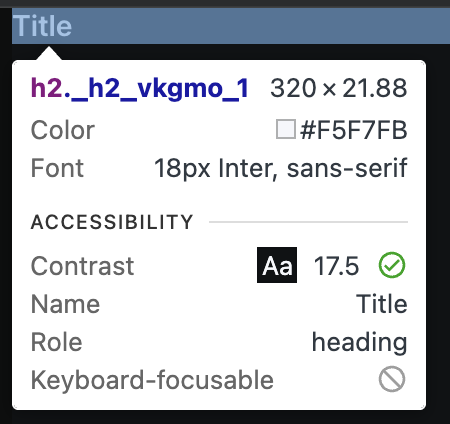

# TC-MC-0036 — UI: H2 – Mobile – Dark Theme – Typography Tokens

## Objective

Validate that the `H2` UI component renders correctly on **Mobile** viewport in **Dark theme**, using the expected typography design tokens and semantic `<h2>` behavior defined in ticket  
[MC-0004-UI-kit-Create-H2-component](../../../tickets/Story/MC-0004-UI-kit-Create-H2-component.md).

Specifically confirm on mobile range (<768px):

- correct `<h2>` semantics in the DOM
- correct font family (inheriting **Inter**)
- correct mobile font size from token `--font-size-h-2`
- correct font-weight via `--font-weight-semi`
- correct text color for **Dark** theme via `--color-text`
- correct line-height
- no visual or spacing inconsistencies at small widths

---

## Preconditions

- Application or Storybook is running.
- The `H2` component is available (e.g., via Storybook story `UI / Atoms / H2`).
- Browser viewport width is within **mobile range <768px**.
- Application theme is set to **Dark**.
- Design tokens are loaded:
	- `--color-text`
	- `--font-size-h-2`
	- `--font-weight-semi`
- Browser devtools are available to inspect computed styles.

---

## Test Data

_Static UI verification; no dynamic data required._

Environment assumptions:

| Parameter      | Value                    |
|----------------|--------------------------|
| Device         | Mobile (simulated)       |
| Viewport       | < 768px                  |
| Theme          | Dark                     |
| Browser        | Latest Chrome / Chromium |

Recommended specific widths:

| Scenario       | Width (px) |
|----------------|------------|
| Mobile check   | 375        |

---

## Steps

1. Open Storybook or the application in a desktop browser (or device emulator).
2. Set viewport width to a mobile value **<768px** (for example, **375px**).
3. Ensure the **Dark** theme is active.
4. Navigate to the [H2 default story iframe (Dark theme)](https://leva13007.github.io/memora-cards-storybook/iframe.html?id=ui-atoms-h2--default&viewMode=story&globals=theme:dark) or `H2` [Storybook docs page](https://leva13007.github.io/memora-cards-storybook/?path=/docs/ui-atoms-h2--docs) that showcases the `H2` component (`UI / Atoms / H2`).
5. If the story supports controls/args for content, set the heading text to a simple value (for example, `"Section title"`). Otherwise, use the default example text shown in the story.
6. Identify a rendered `H2` element in the canvas area.
7. Open browser devtools and inspect the heading element.
8. In the **Elements** panel, verify that the rendered element is a semantic `<h2>` (not ``, `
`, or another tag).
9. In the **Styles** or **Computed** panel, verify the following CSS properties on the `<h2>` element:
	- `font-family`
	- `font-size`
	- `font-weight`
	- `line-height`
	- `color`
10. Confirm that the typography styles originate from or match the expected design tokens:
	- `--font-size-h-2`
	- `--font-weight-semi`
	- `--color-text`
11. Visually inspect the heading at mobile width for any spacing, wrapping, clipping, or layout issues.

---

## Expected Result

- The component renders a semantic heading element:
	- `<h2>…</h2>`
- `font-family` = inherit from (_Inter_) or **Inter**
- `font-size` = **1.125rem (Mobile)**, sourced from token `--font-size-h-2`
- `font-weight` = **600**, mapped from token `--font-weight-semi`
- `line-height` = **normal** (or browser-resolved equivalent)
- In **Dark theme**:
	- `color` = `#f5f7fb` equals the resolved value of **`--color-text`**
- No unexpected spacing, clipping, overlaps, or rendering artifacts at mobile viewport widths

---

## Screenshots / Attachments (optional)

- Screenshot of `H2` rendering on Mobile + Dark theme at ~375px width (showing default or example heading text)

---

## Edge Cases

*(Not required for pass/fail, but recommended to observe)*

- Move viewport around the mobile breakpoint:
	- **≤767px** (mobile) should use `1.125rem` from `--font-size-h-2`
	- **≥768px** (tablet) should use `1.25rem` from `--font-size-h-2`
- Test long heading text that wraps to multiple lines at small mobile widths and verify line-height and spacing remain visually consistent.
- Verify that global theme toggling Dark → Light → Dark correctly updates `--color-text` for H2 and does not break typography tokens.

---

## Notes

- This test case covers only **Mobile (<768px) + Dark theme** for the `H2` component.
- Separate test cases should cover Light theme and Desktop/Tablet breakpoints.
- Typography expectations must match the `H2` specification in MC-0004.

---

## Related

- Ticket: [MC-0004-UI-kit-Create-H2-component](../../../tickets/Story/MC-0004-UI-kit-Create-H2-component.md)
