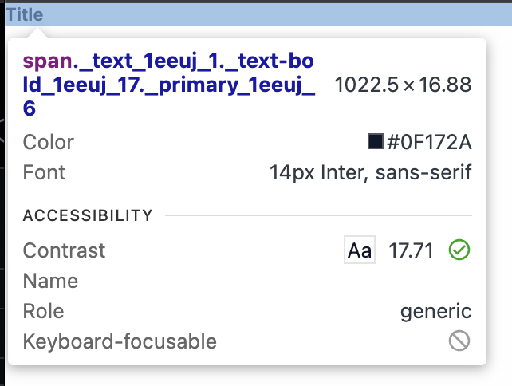

# TC-MC-0002 — UI: TextBold – Desktop – Dark Theme – Typography Tokens

## Objective

Validate that the `TextBold` UI component renders correctly on **Desktop** in **Dark theme**, using the expected typography design tokens and computed styles defined in ticket  
[MC-0001-UI-kit-Create-Text-component](../../../tickets/MC-0001-UI-kit-Create-Text-component.md).

Specifically confirm:

- correct font family
- correct font size from token `--fonts-size-text`
- correct font-weight via `--font-weight-semi`
- correct text color for **Dark** theme when `variant="primary"`
- correct behavior when `variant="warning"`
- correct default `as` prop (``) and optional `as="p"` behavior
- correct line-height
- no visual or spacing inconsistencies

---

## Preconditions

- Application or Storybook is running.
- The `TextBold` component is available (e.g., via Storybook story `UI / Atoms / TextBold`).
- Browser viewport width is ≥ **1280px** (desktop breakpoint).
- Application theme is set to **Dark**.
- Design tokens are loaded:
	- `--color-text`
	- `--fonts-size-text`
	- `--font-weight-semi`
- Browser devtools are available to inspect computed styles.

---

## Test Data

_Static UI verification; no dynamic data required._

Environment assumptions:

| Parameter      | Value                    |
|----------------|--------------------------|
| Device         | Desktop                  |
| Viewport       | ≥ 1280px                 |
| Theme          | Dark                     |
| Browser        | Latest Chrome / Chromium |

---

## Steps

1. Open Storybook or the application in a desktop browser.
2. Set viewport width to **≥ 1280px**.
3. Ensure the **Dark** theme is active.
4. Navigate to the [page](https://leva13007.github.io/memora-cards-storybook/iframe.html?id=ui-atoms-textbold--default&viewMode=story&globals=theme:dark) or [Storybook story](https://leva13007.github.io/memora-cards-storybook/?path=/docs/ui-atoms-textbold--docs) that showcases the `TextBold` component (`UI / Atoms / TextBold`).
5. Identify a sample `TextBold` text element (e.g., “Sample Bold Text”).
6. Open browser devtools and inspect the element.
7. In the **Styles** or **Computed** panel, verify the following CSS properties:
	 - `font-family`
	 - `font-size`
	 - `font-weight`
	 - `line-height`
	 - `color`
8. Confirm that the styles originate from or match the expected design tokens:
	 - `--fonts-size-text`
	 - `--font-weight-semi`
	 - `--color-text`

9. Toggle `variant` prop or visit the page with different variants:
  - Set `variant="primary"` or open the [page](https://leva13007.github.io/memora-cards-storybook/iframe.html?id=ui-atoms-textbold--default&viewMode=story&args=variant:primary&globals=theme:dark) and verify color uses `--color-text`.
  - Set `variant="warning"` or open the [page](https://leva13007.github.io/memora-cards-storybook/iframe.html?id=ui-atoms-textbold--default&viewMode=story&args=variant:warning&globals=theme:dark) and verify color uses `--color-warning`.

10. Toggle `as` prop or visit the page with different variants:
   - Without passing `as` or when `as="span"` or open the [page](https://leva13007.github.io/memora-cards-storybook/iframe.html?id=ui-atoms-textbold--default&viewMode=story&args=as%3Aspan&globals=theme:dark), verify the element is rendered as ``.
   - Set `as="p"` or open the [page](https://leva13007.github.io/memora-cards-storybook/iframe.html?id=ui-atoms-textbold--default&viewMode=story&args=as%3Ap&globals=theme:dark), verify the element is rendered as `
`.
   - In both cases, confirm typography tokens (font-size, weight, line-height, variant color) remain correct.

---

## Expected Result

- `font-family` = inherit from (_Inter_) or **Inter**
- `font-size` = **1rem (16px)**, sourced from `--fonts-size-text`
- `font-weight` = **600**, mapped from token `--font-weight-semi`
- `line-height` = **normal** (or browser-resolved equivalent)
- When `variant="primary"`, `color` = `#f5f7fb` equals the resolved value of **`--color-text`** for **Dark theme**
- When `variant="warning"`, `color` = `#ec1515` equals the resolved value of **`--color-warning`** (for both Light and Dark themes)
- When `as` is not provided, the rendered element is ``
- When `as="p"`, the rendered element is `
` and typography tokens remain unchanged
- No unexpected spacing, clipping, overlaps, or rendering artifacts

---

## Screenshots / Attachments (optional)

- Screenshot of component rendering on Desktop + Dark theme

---

## Edge Cases

*(Not required for pass/fail, but recommended to observe)*
- Toggle Dark → Light → Dark and verify color token re-evaluates correctly back to Dark theme value.
- Test long text wrapping to ensure no layout shifts.

---

## Notes

- This test case covers only **Desktop + Dark theme**.
- Additional test cases are required for Tablet, Mobile, and Light theme variants (see related cases).

---

## Related

- Ticket: [MC-0001-UI-kit-Create-Text-component](../../../tickets/MC-0001-UI-kit-Create-Text-component.md)
