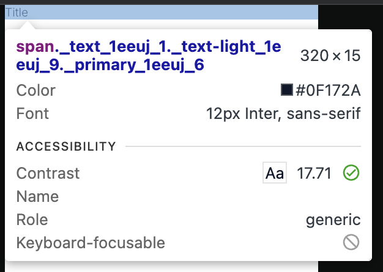

# TC-MC-0017 — UI: TextLight – Mobile – Light Theme – Typography Tokens

## Objective

Validate that the `TextLight` UI component renders correctly on **Mobile** viewport in **Light theme**, using the expected typography design tokens and computed styles defined in ticket  
[MC-0001-UI-kit-Create-Text-component](../../../tickets/MC-0001-UI-kit-Create-Text-component.md).

Specifically confirm on mobile range (<768px):

- correct font family
- correct mobile font size from token `--fonts-size-text`
- correct font-weight via `--font-weight-light`
- correct text color for **Light** theme when `variant="primary"`
- correct behavior when `variant="warning"`
- correct default `as` prop (``) and optional `as="p"` behavior
- correct line-height
- no visual or spacing inconsistencies

---

## Preconditions

- Application or Storybook is running.
- The `TextLight` component is available (e.g., via Storybook story `UI / Atoms / TextLight`).
- Browser viewport width is within **mobile range < 768px**.
- Application theme is set to **Light**.
- Design tokens are loaded:
	- `--color-text`
	- `--fonts-size-text`
	- `--font-weight-light`
- Browser devtools are available to inspect computed styles.

---

## Test Data

_Static UI verification; no dynamic data required._

Environment assumptions:

| Parameter      | Value                    |
|----------------|--------------------------|
| Device         | Mobile (simulated)       |
| Viewport       | < 768px                  |
| Theme          | Light                    |
| Browser        | Latest Chrome / Chromium |

Recommended specific widths:

| Scenario       | Width (px) |
|----------------|------------|
| Mobile check   | 375        |

---

## Steps

1. Open Storybook or the application in a desktop browser (or device emulator).
2. Set viewport width to a mobile value **< 768px** (for example, **375px**).
3. Ensure the **Light** theme is active.
4. Navigate to the [page](https://leva13007.github.io/memora-cards-storybook/iframe.html?id=ui-atoms-textlight--default&viewMode=story) or [Storybook story](https://leva13007.github.io/memora-cards-storybook/?path=/docs/ui-atoms-textlight--docs) that showcases the `TextLight` component (`UI / Atoms / TextLight`).
5. Identify a sample `TextLight` text element (e.g., "Sample Light Text").
6. Open browser devtools and inspect the element.
7. In the **Styles** or **Computed** panel, verify the following CSS properties:
	- `font-family`
	- `font-size`
	- `font-weight`
	- `line-height`
	- `color`
8. Confirm that the styles originate from or match the expected design tokens:
	- `--fonts-size-text`
	- `--font-weight-light`
	- `--color-text`

9. Toggle `variant` prop or visit the page with different variants:
	- Set `variant="primary"` or open the [page](https://leva13007.github.io/memora-cards-storybook/iframe.html?globals=&args=&id=ui-atoms-textlight--primary&viewMode=story) and verify color uses `--color-text`.
	- Set `variant="warning"` or open the [page](https://leva13007.github.io/memora-cards-storybook/iframe.html?globals=&args=&id=ui-atoms-textlight--warning&viewMode=story) and verify color uses `--color-warning`.

10. Toggle `as` prop or visit the page with different variants:
	- Without passing `as` or when `as="span"` or open the [page](https://leva13007.github.io/memora-cards-storybook/iframe.html?globals=&args=&id=ui-atoms-textlight--span&viewMode=story), verify the element is rendered as ``.
	- Set `as="p"` or open the [page](https://leva13007.github.io/memora-cards-storybook/iframe.html?globals=&args=&id=ui-atoms-textlight--paragraph&viewMode=story), verify the element is rendered as `
`.
	- In both cases, confirm typography tokens (font-size, weight, line-height, variant color) remain correct.

---

## Expected Result

- `font-family` = inherit from (_Inter_) or **Inter**
- `font-size` = **0.75rem (12px)** for mobile, sourced from `--fonts-size-text`
- `font-weight` = **300**, mapped from token `--font-weight-light`
- `line-height` = **normal** (or browser-resolved equivalent)
- When `variant="primary"`, `color` = `#0f172a` equals the resolved value of **`--color-text`** for **Light theme**
- When `variant="warning"`, `color` = `#ec1515` equals the resolved value of **`--color-warning`** (for both Light and Dark themes)
- When `as` is not provided, the rendered element is ``
- When `as="p"`, the rendered element is `
` and typography tokens remain unchanged
- No unexpected spacing, clipping, overlaps, or rendering artifacts

---

## Screenshots / Attachments (optional)

- Screenshot of component rendering on Mobile + Light theme at ~375px width

---

## Edge Cases

*(Not required for pass/fail, but recommended to observe)*

- Move viewport just below and above the mobile range:
	- Around **767px** to confirm tablet font-size **0.875rem** is applied
- Toggle Light → Dark → Light and verify color token re-evaluates correctly back to Light theme value for `variant="primary"` and does not affect `variant="warning"` using `--color-warning`.
- Test long text wrapping and multi-line content to ensure no layout shifts at small mobile widths.

---

## Notes

- This test case covers only **Mobile (<768px) + Light theme** for the `TextLight` component.
- Complementary test cases cover Tablet, Desktop, and Dark theme variants, and analogous cases exist for `TextMedium` and `TextBold`.

---

## Related

- Ticket: [MC-0001-UI-kit-Create-Text-component](../../../tickets/MC-0001-UI-kit-Create-Text-component.md)
