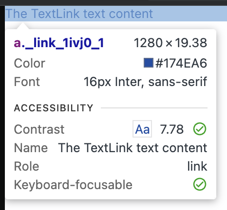
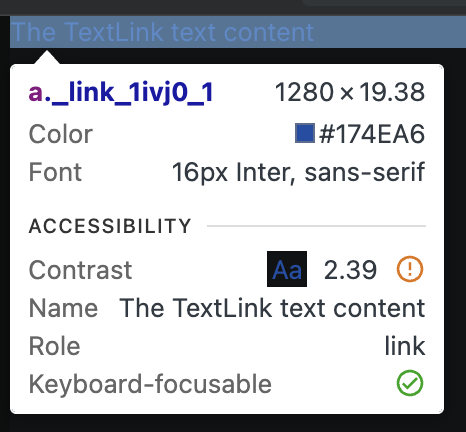

# TC-MC-0020 — UI: TextLink – Desktop – Dark Theme – Typography & Link Tokens

## Objective

Validate that the `TextLink` UI component renders correctly on **Desktop** in **Dark theme**, using the expected typography design tokens (inheriting from `TextMedium`) and link-specific color tokens defined in ticket  
[MC-0002-UI-kit-Create-TextLink-component](../../../tickets/Story/MC-0002-UI-kit-Create-TextLink-component.md).

Specifically confirm on desktop viewport (≥1280px):

- correct font family
- correct desktop font size from token `--fonts-size-text`
- correct font-weight via `--font-weight-normal`
- correct link color for **Dark** theme via `--color-link`
- correct hover color via `--color-link-hover`
- correct `cursor` and `text-decoration` styles
- correct mapping of `to` → `href` and `content` → visible text
- correct line-height
- no visual or spacing inconsistencies
- Storybook navigation behavior is effectively turned off

---

## Preconditions

- Application or Storybook is running.
- The `TextLink` component is available (e.g., via Storybook story `UI / Atoms / TextLink`).
- Browser viewport width is ≥ **1280px** (desktop breakpoint).
- Application theme is set to **Dark**.
- Design tokens are loaded:
	- `--fonts-size-text`
	- `--font-weight-normal`
	- `--color-link`
	- `--color-link-hover`
- Browser devtools are available to inspect computed styles.

---

## Test Data

_Static UI verification; no dynamic data required._

Environment assumptions:

| Parameter      | Value                    |
|----------------|--------------------------|
| Device         | Desktop                  |
| Viewport       | ≥ 1280px                 |
| Theme          | Dark                     |
| Browser        | Latest Chrome / Chromium |

Example props:

| Prop     | Example value                 |
|----------|-------------------------------|
| `to`     | `/docs`                       |
| `content`| `"The TextLink text content"` |

---

## Steps

1. Open Storybook or the application in a desktop browser.
2. Set viewport width to **≥ 1280px**.
3. Ensure the **Dark** theme is active.
4. Navigate to the [page](https://leva13007.github.io/memora-cards-storybook/iframe.html?id=ui-atoms-textlink--default&viewMode=story&globals=theme:dark) or `TextLink` [Storybook story](https://leva13007.github.io/memora-cards-storybook/?path=/docs/ui-atoms-textlink--docs) that showcases the `TextLink` component (`UI / Atoms / TextLink`).
5. Configure the story or component props to use:
	- `to="/docs"` or open the [page](https://leva13007.github.io/memora-cards-storybook/iframe.html?id=ui-atoms-textlink--default&viewMode=story&args=to:docs&globals=theme:dark)
	- `content="The TextLink text content"` or open the [page](https://leva13007.github.io/memora-cards-storybook/iframe.html?id=ui-atoms-textlink--default&viewMode=story&args=content%3AThe%20TextLink%20text%20content&globals=theme:dark)
  - final link should be as: [final link](https://leva13007.github.io/memora-cards-storybook/iframe.html?id=ui-atoms-textlink--default&viewMode=story&args=to:docs;content:The%20TextLink%20text%20content&globals=theme:dark)
6. Identify a `TextLink` element rendered with these props.
7. Open browser devtools and inspect the `<a>` element.
8. In the **Elements** panel, confirm the DOM structure is:
	- `<a href="/docs">The TextLink text content</a>` (or equivalent URL from `to` and `content`).
9. In the **Styles** or **Computed** panel, verify the following CSS properties on the `<a>` element:
	- `font-family`
	- `font-size`
	- `font-weight`
	- `line-height`
	- `color`
	- `cursor`
	- `text-decoration`
10. Confirm that the typography styles originate from or match the expected design tokens (same as `TextMedium`):
	- `--fonts-size-text`
	- `--font-weight-normal`
11. Confirm that the link colors originate from the link-specific tokens:
	- `--color-link`
	- `--color-link-hover`
12. With the pointer **not hovering** over the link, verify that:
	- `color` resolves to the Dark theme value of `--color-link`.
13. Move the mouse pointer over the `TextLink` or set in Devtools panel to the `:hover` state and verify that:
	- `color` changes to the value of `--color-link-hover`.
14. Verify that:
	- `cursor` is `pointer`
	- `text-decoration` is `unset` (no default underline), unless a design-system class intentionally adds a specific decoration.
15. Click the link inside the Storybook story and confirm that the Storybook UI does **not** navigate away (navigation behavior is disabled in stories—from the user perspective, the page should remain in the Storybook environment).

---

## Expected Result

- `font-family` = inherit from (_Inter_) or **Inter**
- `font-size` = **1rem (16px)** for desktop, sourced from `--fonts-size-text`
- `font-weight` = **400**, mapped from token `--font-weight-normal`
- `line-height` = **normal** (or browser-resolved equivalent)
- In **Dark theme**, when not hovered:
	- `color` = `#8ab4f8` equals the resolved value of **`--color-link`**
- In **Dark theme**, on hover:
	- `color` = `#174ea6` equals the resolved value of **`--color-link-hover`**
- `cursor` = `pointer`
- `text-decoration` = `unset` (no browser default underline)
- The component renders a semantic anchor element:
	- `<a href="/docs">The TextLink text content</a>` (or equivalent `to`/`content` values)
- Clicking the `TextLink` inside Storybook does not navigate away from the Storybook environment (navigation effectively disabled in stories)
- No unexpected spacing, clipping, overlaps, or rendering artifacts

---

## Screenshots / Attachments (optional)

- Screenshot of `TextLink` rendering on Desktop + Dark theme (showing default state)

- Screenshot of `TextLink` rendering on Desktop + Dark theme (showing hover state)

---

## Edge Cases

*(Not required for pass/fail, but recommended to observe)*
- Test very long `content` strings to verify wrapping and hover behavior across multiple lines.
- Use different `to` values (absolute URL, relative path, hash, `mailto:`) and confirm they map correctly to `href` without affecting typography or tokens.
- Temporarily enable real navigation (outside Storybook) and verify that clicking the link navigates to the `to` target while preserving visual styling.

---

## Notes

- This test case covers only **Desktop + Dark theme** for the `TextLink` component.
- Separate test cases should cover Light theme and Tablet/Mobile variants.
- Typography expectations should match `TextMedium` Desktop + Dark behavior, except for using link-specific color tokens instead of `--color-text`.

---

## Related

- Ticket: [MC-0002-UI-kit-Create-TextLink-component](../../../tickets/Story/MC-0002-UI-kit-Create-TextLink-component.md)
