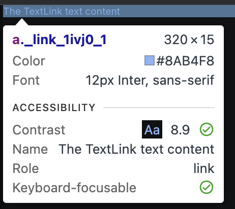
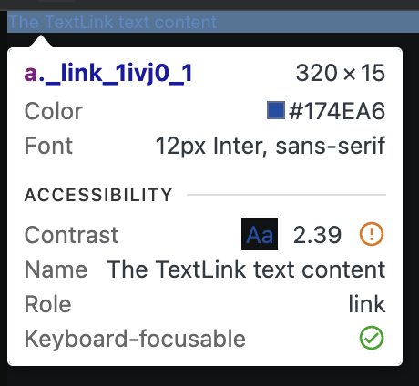

# TC-MC-0024 — UI: TextLink – Mobile – Dark Theme – Typography & Link Tokens

## Objective

Validate that the `TextLink` UI component renders correctly on **Mobile** viewport in **Dark theme**, using the expected typography design tokens (inheriting from `TextMedium`) and link-specific color tokens defined in ticket  
[MC-0002-UI-kit-Create-TextLink-component](../../../tickets/MC-0002-UI-kit-Create-TextLink-component.md).

Specifically confirm on mobile range (<768px):

- correct font family
- correct mobile font size from token `--fonts-size-text`
- correct font-weight via `--font-weight-normal`
- correct link color for **Dark** theme via `--color-link`
- correct hover (or pressed/tap-highlight) color via `--color-link-hover`
- correct `cursor` and `text-decoration` styles (where applicable)
- correct mapping of `to` → `href` and `content` → visible text
- correct line-height
- no visual or spacing inconsistencies
- Storybook navigation behavior is effectively turned off

---

## Preconditions

- Application or Storybook is running.
- The `TextLink` component is available (e.g., via Storybook story `UI / Atoms / TextLink`).
- Browser viewport width is within **mobile range <768px**.
- Application theme is set to **Dark**.
- Design tokens are loaded:
	- `--fonts-size-text`
	- `--font-weight-normal`
	- `--color-link`
	- `--color-link-hover`
- Browser devtools are available to inspect computed styles.

---

## Test Data

_Static UI verification; no dynamic data required._

Environment assumptions:

| Parameter      | Value                    |
|----------------|--------------------------|
| Device         | Mobile (simulated)       |
| Viewport       | < 768px                  |
| Theme          | Dark                     |
| Browser        | Latest Chrome / Chromium |

Recommended specific widths:

| Scenario       | Width (px) |
|----------------|------------|
| Mobile check   | 375        |

Example props:

| Prop     | Example value                  |
|----------|--------------------------------|
| `to`     | `/docs`                        |
| `content`| "The TextLink text content" |

---

## Steps

1. Open Storybook or the application in a desktop browser (or device emulator).
2. Set viewport width to a mobile value **<768px** (for example, **375px**).
3. Ensure the **Dark** theme is active.
4. Navigate to the [page](https://leva13007.github.io/memora-cards-storybook/iframe.html?id=ui-atoms-textlink--default&viewMode=story&globals=theme:dark) or `TextLink` [Storybook story](https://leva13007.github.io/memora-cards-storybook/?path=/docs/ui-atoms-textlink--docs) that showcases the `TextLink` component (`UI / Atoms / TextLink`).
5. Configure the story or component props to use:
	- `to="/docs"` or open the [page](https://leva13007.github.io/memora-cards-storybook/iframe.html?id=ui-atoms-textlink--default&viewMode=story&args=to:docs&globals=theme:dark)
	- `content="The TextLink text content"` or open the [page](https://leva13007.github.io/memora-cards-storybook/iframe.html?id=ui-atoms-textlink--default&viewMode=story&args=content%3AThe%20TextLink%20text%20content&globals=theme:dark)
6. Identify a `TextLink` element rendered with these props.
7. Open browser devtools and inspect the `<a>` element.
8. In the **Elements** panel, confirm the DOM structure is:
	- `<a href="/docs">The TextLink text content</a>` (or equivalent URL from `to` and `content`).
9. In the **Styles** or **Computed** panel, verify the following CSS properties on the `<a>` element:
	- `font-family`
	- `font-size`
	- `font-weight`
	- `line-height`
	- `color`
	- `cursor` (in desktop simulation)
	- `text-decoration`
10. Confirm that the typography styles originate from or match the expected design tokens (same as `TextMedium`):
	- `--fonts-size-text`
	- `--font-weight-normal`
11. Confirm that the link colors originate from the link-specific tokens:
	- `--color-link`
	- `--color-link-hover`
12. With the pointer **not hovering** over the link (or at rest on mobile simulation), verify that:
	- `color` resolves to the Dark theme value of `--color-link`.
13. Move the mouse pointer over the `TextLink` (desktop simulation) or simulate a press/hover state in devtools (`:hover`) and verify that:
	- `color` changes to the value of `--color-link-hover`.
14. Verify that (on desktop/mobile simulation as applicable):
	- `cursor` is `pointer`
	- `text-decoration` is `unset` (no default underline), unless a design-system class intentionally adds a specific decoration.
15. Click/tap the link inside the Storybook story and confirm that the Storybook UI does **not** navigate away (navigation behavior is disabled in stories—from the user perspective, the page should remain in the Storybook environment).

---

## Expected Result

- `font-family` = inherit from (_Inter_) or **Inter**
- `font-size` = **0.75rem (12px)** for mobile, sourced from `--fonts-size-text`
- `font-weight` = **400**, mapped from token `--font-weight-normal`
- `line-height` = **normal** (or browser-resolved equivalent)
- In **Dark theme**, when not hovered/pressed:
	- `color` = `#8ab4f8` equals the resolved value of **`--color-link`**
- In **Dark theme**, on hover/press:
	- `color` = `#174ea6` equals the resolved value of **`--color-link-hover`**
- `cursor` = `pointer` (on desktop simulation)
- `text-decoration` = `unset` (no browser default underline)
- The component renders a semantic anchor element:
	- `<a href="/docs">The TextLink text content</a>` (or equivalent `to`/`content` values)
- Clicking/tapping the `TextLink` inside Storybook does not navigate away from the Storybook environment (navigation effectively disabled in stories)
- No unexpected spacing, clipping, overlaps, or rendering artifacts

---

## Screenshots / Attachments (optional)

- Screenshot of `TextLink` rendering on Mobile + Dark theme (showing default state)

- Screenshot of `TextLink` rendering on Mobile + Dark theme (showing pressed/hover state)

---

## Edge Cases

*(Not required for pass/fail, but recommended to observe)*

- Move viewport around the mobile breakpoint:
	- **≤767px** (mobile) should use `0.75rem` font-size
	- **≥768px** (tablet) should use `0.875rem` font-size
- Test very long `content` strings to verify wrapping and hover/tap behavior across multiple lines at mobile width in Dark theme.
- Use different `to` values (absolute URL, relative path, hash, `mailto:`) and confirm they map correctly to `href` without affecting typography or tokens.

---

## Notes

- This test case covers only **Mobile (<768px) + Dark theme** for the `TextLink` component.
- Separate test cases cover Light theme and Desktop/Tablet variants.
- Typography expectations should match `TextMedium` Mobile + Dark behavior, except for using link-specific color tokens instead of `--color-text`.

---

## Related

- Ticket: [MC-0002-UI-kit-Create-TextLink-component](../../../tickets/MC-0002-UI-kit-Create-TextLink-component.md)
