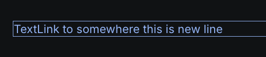
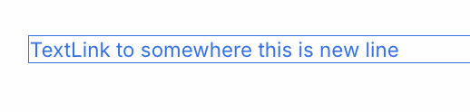

# TC-MC-0044 — UI: TextLink — Accessibility (keyboard focus)

## 🎯 Objective
Validate that `TextLink` is accessible for keyboard users and provides a clear focus indicator using the required `:focus-visible` outline style:

`outline: 1px solid var(--color-link, currentColor)`

This test focuses on accessibility/semantics and does **not** re-test typography tokens (covered by the theme/breakpoint TextLink TCs).

---

## Preconditions
- Storybook or the application is running.
- `TextLink` is available (Storybook: `UI / Atoms / TextLink`).
- Browser devtools are available to inspect:
	- DOM structure
	- computed styles

Storybook references:
- Docs: https://leva13007.github.io/memora-cards-storybook/?path=/docs/ui-atoms-textlink--docs
- Story: https://leva13007.github.io/memora-cards-storybook/iframe.html?id=ui-atoms-textlink--default&viewMode=story

---

## Test Data

Example props:

| Prop      | Example value |
|-----------|---------------|
| `to`      | `/docs`       |
| `content` | `Docs link`   |

Run the same checks in both themes:
- Light
- Dark

---

## Steps
### Scenario 1 — Light Theme coverage (outline visibility)
1. Open the `TextLink` story.
2. Switch theme to **Light**.
3. Configure the component with `to="/docs"` and `content="Docs link"`.
4. Inspect the rendered element in the DOM.
5. Click somewhere outside the `TextLink` component to reset focus.
6. Press `Tab` until(once!) the `TextLink` receives focus.
7. Observe the focus indicator.
8. Inspect computed styles for the focused state.
9. With the `TextLink` focused via keyboard, verify that the focus indicator comes from `:focus-visible` (not only `:focus`).
10. Confirm that the link outline colors originate from the link-specific tokens:
	- `--color-link`

### Scenario 2 — Dark Theme coverage (outline visibility)
1. Switch theme to **Dark**.
2. Repeat Scenario 2 and confirm the outline is visible.

---

## Expected Result

### Scenario 1 — Light Theme coverage (outline visibility)
- Component renders a semantic anchor element (`<a>`).
- Anchor has `href` matching the `to` prop.
- `TextLink` is reachable via keyboard navigation (Tab).
- When focused via keyboard, it shows a visible focus outline.
- Focus indicator uses the required style:
	- `.link:focus-visible { outline: 1px solid var(--color-link, currentColor); }`
- `outline-color` = `#1a73e8` equals the resolved value of **`--color-link`**

### Scenario 2 — Dark Theme coverage
- Focus outline remains visible in Dark themes and uses the correct color token.

---

### Screenshots / Attachments

- Dark Theme example:

- Light Theme example:

---

## Edge Cases

- Very long link text:
	- focus outline still fully visible around the focused element (no clipping).
- `to` value is a hash or mailto (e.g., `#section`, `mailto:test@example.com`):
	- still rendered as `<a>` and still shows focus-visible outline.

---

## Notes
- If the component does not expose a `.link` class, adapt the selector in implementation (but acceptance criteria in the ticket expects `.link:focus-visible`).

---

## Related

- Ticket: [MC-0002-UI-kit-Create-TextLink-component](../../../tickets/Story/MC-0002-UI-kit-Create-TextLink-component.md)
